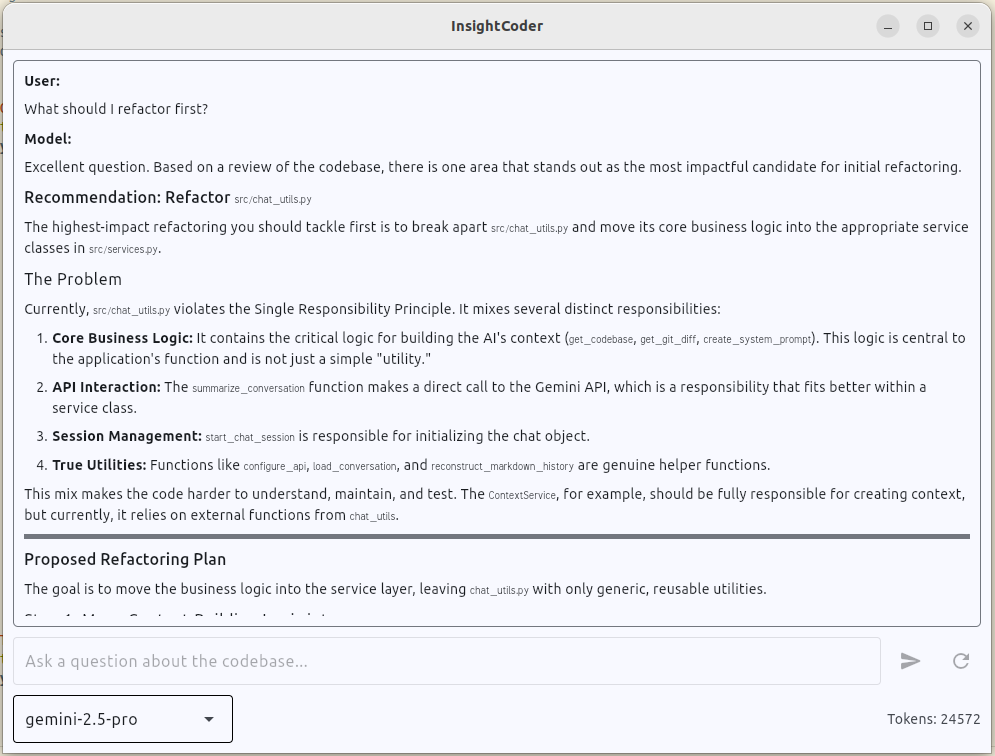

# InsightCoder

**InsightCoder** is AI-powered tool that gives you deep insights into your codebases. By leveraging Large Language Models (LLMs), you can ask complex questions about any Git repository—whether it's code, documentation, or a book—and get intelligent, context-aware answers.

It was born out of the need for a powerful codebase analysis tool during the development of the [Anagnorisis project](https://github.com/volotat/Anagnorisis).

**⚠️ Important Privacy Notice**: InsightCoder sends your project's source code to an external LLM service (Google Gemini) for analysis. **Do not use this tool on repositories containing personal, confidential, or sensitive information.**

<!-- Screenshot of the program -->
  
Project preview

## Core Features

*   **Holistic Project Analysis:** Analyzes your entire Git repository, including uncommitted changes, to provide comprehensive context.
*   **Persistent Memory:** Saves conversation summaries to maintain context across sessions, enabling follow-up questions.
*   **Large Context Models:** Uses LLMs with large context windows (e.g., Gemini 2.5 Pro) to understand complex projects.
*   **Interactive Chat UI:** A simple terminal-based UI for asking questions and receiving Markdown-formatted responses with syntax highlighting.
*   **Real-time Token Counter:** Helps you monitor the context size of your conversation.

## InsightCoder vs. GitHub Copilot

InsightCoder complements tools like GitHub Copilot. They serve different primary purposes:

| Feature             | InsightCoder                                  | GitHub Copilot                                  |
|---------------------|-----------------------------------------------|-------------------------------------------------|
| **Primary Purpose** | Codebase Understanding & High-Level Insights  | Real-time Code Completion & Generation          |
| **Context Scope**   | **Entire Project Codebase** + History         | Current File & Immediate Context                |
| **Best For**        | Architecture questions, onboarding, refactoring ideas | Writing code, boilerplate, line-by-line assistance |

Use **InsightCoder** for deep analysis and understanding. Use **Copilot** for accelerating development.

## Getting Started

**Requirements:**
*   Python 3.8+
*   Git

**Installation:**

1.  **Clone the Repository:**
    ```bash
    git clone https://github.com/volotat/InsightCoder
    cd InsightCoder
    ```

2.  **Set Up Virtual Environment (Recommended):**
    ```bash
    python -m venv .venv
    source .venv/bin/activate  # On Windows, use: .venv\Scripts\activate
    ```

3.  **Install Dependencies:**
    ```bash
    pip install -r requirements.txt
    ```

4.  **Configure API Key:**
    Get a Google Gemini API key from [Google AI Studio](https://makersuite.google.com/app/apikey) and set it as an environment variable:
    ```bash
    export GEMINI_API_KEY="YOUR_API_KEY_HERE"
    ```

## Usage

1.  **Navigate to the InsightCoder directory:**
    ```bash
    cd InsightCoder
    ```

2.  **Run the script:**
    To analyze the current directory:
    ```bash
    python ask.py
    ```

3.  **Analyze a specific project:**
    Use the `-p` or `--project-path` argument.
    ```bash
    python ask.py -p /path/to/your/project
    ```

4.  **Use a custom conversation folder:**
    By default, conversations are saved in `<project-path>/project_info/conversations`. Use `-c` or `--conversation-path` to change this.
    ```bash
    python ask.py -p /path/to/your/project -c /path/to/your/conversations
    ```


## Example Prompts

*   "Describe the overall architecture of this project."
*   "Explain the `ChatWorker` class in `ask_src/worker.py`."
*   "Are there any potential performance bottlenecks in `ask_src/chat_utils.py`?"
*   "Suggest refactoring strategies for `ask_src/ui.py`."
*   "Generate a class diagram for the main classes and their relationships."
*   "How are API keys handled in this project?"

## Roadmap

For details on planned features and future directions, please see the [ROADMAP.md](ROADMAP.md) file.

## License
InsightCoder is released under the [MIT License](LICENSE).

## Contributing
Bug reports and questions are welcome! Please [open a new issue](https://github.com/volotat/InsightCoder/issues) on GitHub.
