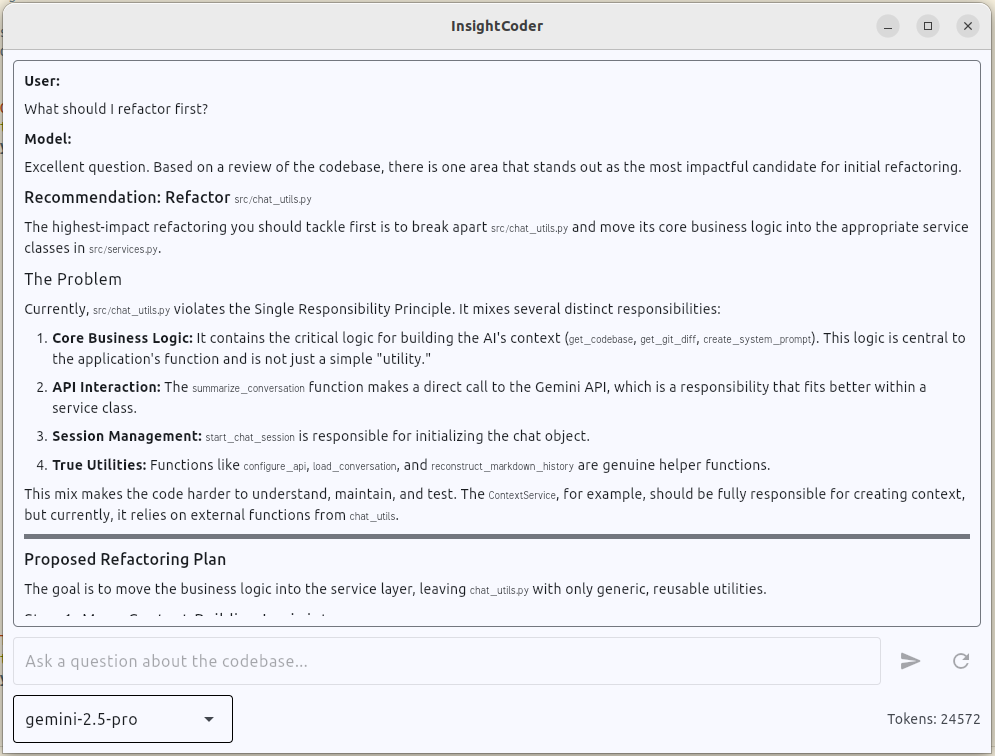

# InsightCoder

InsightCoder is a VS Code extension for asking questions about an entire codebase. It builds the model's context from the whole project — source files, uncommitted git changes, and summaries of previous conversations — so it can answer project-wide questions that single-file assistants cannot: architectural overviews, cross-cutting refactoring plans, or "where is this actually implemented?"

<!---->

> **Privacy notice:** InsightCoder sends your project's source code, including uncommitted changes, to the configured LLM provider (MiniMax or Google Gemini). Do not use it on repositories containing confidential or sensitive information.

## Why InsightCoder

The distinguishing idea is simple: the model always has the whole project in front of it. Every question is answered against the complete codebase — all source files, the current uncommitted changes, and summaries of past conversations — not against a handful of files retrieved on the fly.

This matters because it removes the single largest source of mistakes in agentic coding tools. Harnesses like Claude Code, Cursor, or Copilot build their understanding incrementally: they search, open a few files, guess what's relevant, and act on that partial picture. When the relevant context isn't retrieved, the result is a confident answer that misses the actual intent, breaks an invariant defined in a file that was never opened, or duplicates something that already exists elsewhere. Holistic context sidesteps that class of error — the model isn't reconstructing the project from fragments, it's reading all of it.

Paradoxically, sending "everything" is often *more* token-efficient in practice, not less:

- **No exploratory tool-calling.** Agentic tools spend many round-trips just locating context — grep, read file, read another, list a directory. Each round-trip is a full model query. InsightCoder assembles the context once and asks the model directly, so a question that would take a dozen tool-call turns becomes a single turn.
- **The project understanding isn't rebuilt every time.** In a typical agent, each new task re-derives what the project is and how it fits together. Here that understanding is inherent in the context and is reused across every question in a conversation.
- **The large, unchanging context is cache-friendly.** Because the codebase context is stable and sits at the front of the prompt, providers can serve it from prompt cache on subsequent turns, so the bulk of the input is billed at the reduced cached rate rather than re-processed from scratch.

The trade-off is honest: this approach fits projects that comfortably fit within a large-context model's window, and it favors understanding, review, and planning over autonomous multi-step editing. For deep reasoning about a codebase you already have open, it is faster, cheaper, and less error-prone than repeatedly re-teaching an agent what your project is.

## How it works

The extension scans the open workspace (respecting `.gitignore` and your include/exclude settings, skipping binaries and oversized files), appends the current `git diff`, and sends everything as context with each question. Responses stream into a chat panel in the sidebar. If the assembled context exceeds a configurable token limit, the extension asks for confirmation before sending anything.

The context is fully inspectable: once it is built, files included in it are marked with a check badge in the Explorer (skipped files get a minus badge with the reason), and a toolbar button in the chat panel — also available as the `InsightCoder: Show Assembled Context` command — opens the exact text that will be sent to the model in an editor tab. The panel also shows the number of input tokens the next message will cost before you send anything (exact on Gemini, estimated on MiniMax), updating live as you type.

For models that expose their reasoning, the trace is shown as a collapsible block that is hidden by default. While the model is thinking, the block displays a clear animated indicator with a continuously updating count of tokens spent on reasoning; the completed trace remains available to expand afterwards. If a message fails to reach the model — a network error or a missing API key, for example — the unanswered message can be resent with one click rather than retyped.

Conversations are stored in the extension's own storage, never inside your repository. Each project has its own set of conversations, switchable from the panel, and each conversation is summarized after every turn so future chats retain long-term memory of what was discussed.

Two providers are supported: MiniMax (or any OpenAI-compatible endpoint, configurable via `insightcoder.baseUrl`) and Google Gemini. API keys are kept in VS Code Secret Storage, not in settings files.

## Getting started

1. Install the extension.
2. Open the project you want to analyze.
3. Click the InsightCoder icon in the Activity Bar.
4. Run `InsightCoder: Set API Key…` from the Command Palette and paste your MiniMax or Gemini key.
5. Ask a question.

All commands are available from the Command Palette under the `InsightCoder:` prefix: open the chat, set an API key, reload the project context after large edits, start a new conversation, export the current conversation as Markdown, and show the exact assembled context for debugging.

Behavior is controlled through the `insightcoder.*` settings: provider and model selection, endpoint base URL, context include/exclude globs, the context-size confirmation threshold (`context.maxTokens`, default 500,000), per-file size cap, generation parameters, and whether conversation summaries are generated.

## Running from source

```bash
git clone https://github.com/AlexeyBorsky/InsightCoder.git
cd InsightCoder
npm install
npm run build
```

Open the folder in VS Code and press F5. An Extension Development Host window opens with the extension loaded; open any project there and use it normally. With `npm run watch` running, reload that window (Developer: Reload Window) to pick up code changes.

To install a packaged build instead:

```bash
npm run package
code --install-extension insightcoder-*.vsix
```

Unit tests run with `npm test` (no network required). An optional smoke test against the real provider APIs is available with `MINIMAX_API_KEY=... GEMINI_API_KEY=... npm run test:live`.

## Troubleshooting

Logs are in the Output panel under the InsightCoder channel. To clear a stored API key, run `InsightCoder: Set API Key…` and submit an empty value. Stored conversations live under VS Code's global storage directory and can be deleted from there; nothing is written into the analyzed repository.

## License

[MIT](LICENSE)
